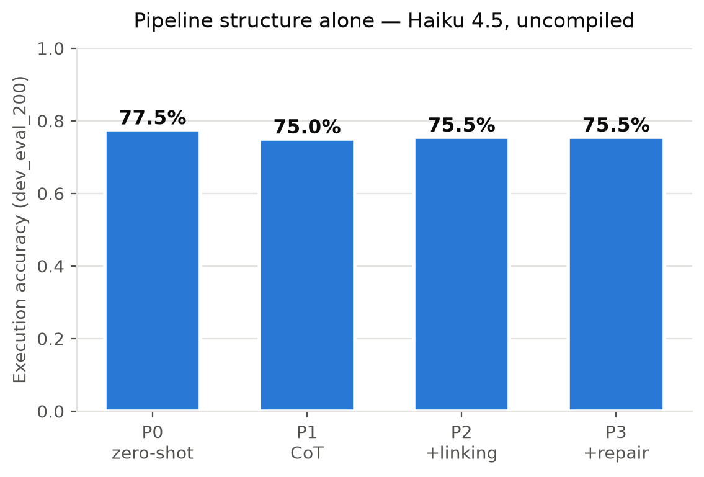

# dspyed

[](https://github.com/edjchapman/dspyed/actions/workflows/check.yml)

*Compiled, not prompted — a measured text-to-SQL pipeline on [Spider](https://yale-lily.github.io/spider), built with [DSPy](https://dspy.ai).*

> **Status: under construction.** Bootstrap + tooling are in place; the pipeline,
> eval harness, and deployed demo land phase by phase. Results tables and figures
> will appear here once the experiment matrix runs.

Natural-language question → SQL → executed against SQLite → answer, measured by
execution accuracy against a committed train/dev split, with DSPy optimizers
compiling the pipeline — and every reported number backed by a committed
results JSON.

## Results

Regenerated from `experiments/results/` by `make report` — numbers never live
in prose. Evaluated on `dev_eval_200` (200 questions, all 20 Spider dev DBs)
unless stated. `$/100 q` and `p50` are marginal, as-executed values: configs
sharing prompt prefixes hit DSPy's disk cache (e.g. P3 reuses P2's link +
generate calls), which is exactly how a production deployment would behave.

<!-- results:begin -->
| Exp | Program | Model | Optimizer | Exec acc | Valid SQL | $/100 q | p50 |
|---|---|---|---|---|---|---|---|
| E01 | P0 zero-shot | Haiku 4.5 | — | **77.5%** | 99.5% | $0.07 | 0.9s |
| E02 | P1 CoT | Haiku 4.5 | — | **75.0%** | 99.5% | $0.13 | 1.7s |
| E03 | P2 +linking | Haiku 4.5 | — | **75.5%** | 99.5% | $0.17 | 2.5s |
| E04 | P3 +repair | Haiku 4.5 | — | **75.5%** | 100.0% | $0.00 | 0.0s |
| E05 | P0 zero-shot | Sonnet 5 | — | **81.0%** | 100.0% | $0.22 | 1.7s |
| E06 | P3 +repair | Sonnet 5 | — | **80.5%** | 100.0% | $0.49 | 3.8s |
<!-- results:end -->



## Quick start

```sh
uv sync            # install runtime + dev dependencies
make check         # the full local gate: links, anchors, lint, types, tests
uv run dspyed      # CLI — subcommands land per phase
```

## Development

`make check` is the single quality gate — CI (`check.yml`), the pre-commit hook,
and the weekly scheduled run all call it. See [CONTRIBUTING.md](CONTRIBUTING.md)
for the branch → PR → squash flow and the strict commit style.

## License

MIT. The Spider dataset is © its authors, licensed CC BY-SA 4.0
(Yu et al., 2018) — an attribution notice ships with any redistributed demo
databases.
